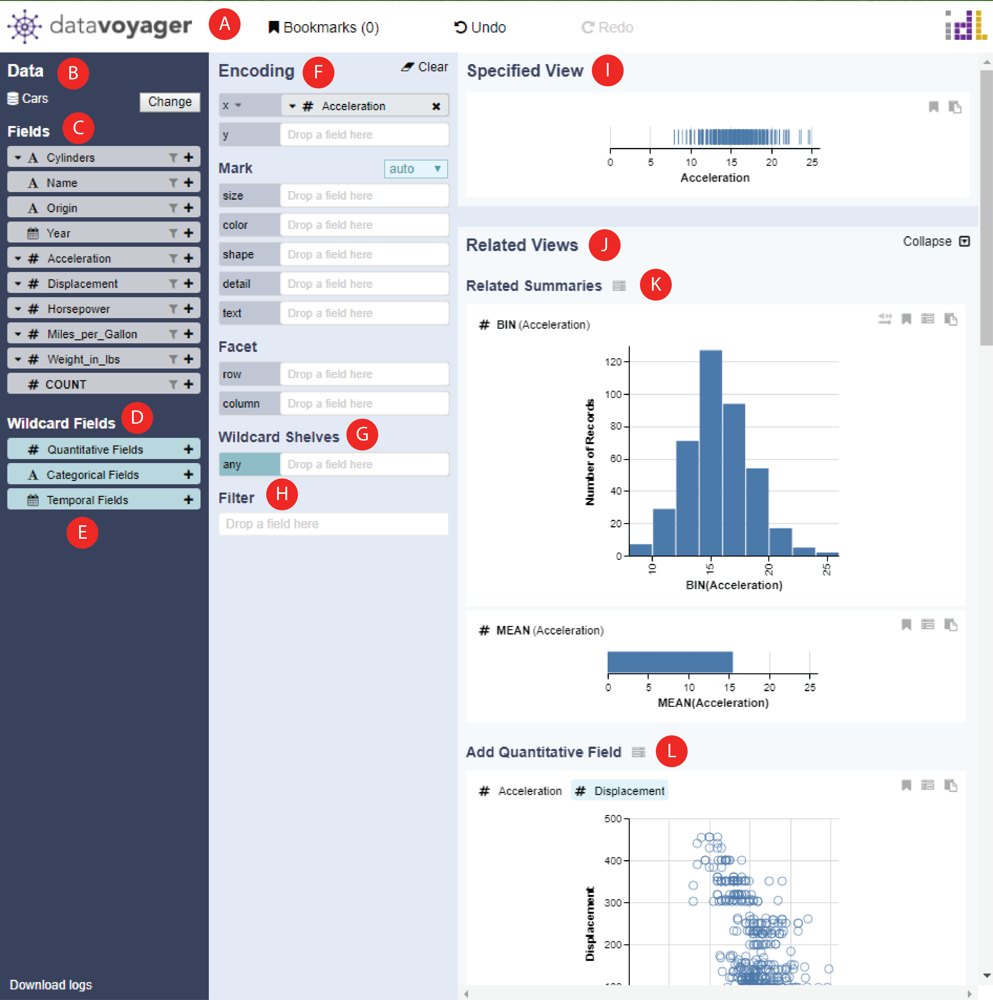

# Introduction

## Project Goals

Voyager 2 is a new mixed-initiative tool that blends manual and automatic chart specification in a unified system. It aims to support smoother gradations between open-ended and more focused phases of analysis. It is a powerful tool that augments traditional visual analysis interfaces with two new partial view specification techniques. Features like wildcards, can allow analysts to precisely vary the properties of a specification to generate multiple charts in parallel, giving them control over sets of views aligned with their analysis goals. Similarly, related views features can automatically recommend charts based on the current user-specified focus view, in which promote the discovery of relevant data fields and alternative ways to summarize or encode the data.

## Interface Overview

The top panel \(A\) provides [bookmark gallery](bookmark-gallery.md) and undo commands. The data panel \(B\) contains the dataset name, data fields \(C\), and wildcard fields \(D\). Wildcard fields let users create multiple views in parallel by serving as "variables" over an enumerated set of fields. Categorical, temporal, and quantitative field wildcards are provided by default, though users can manually author custom wildcards containing desired fields \(E\). The encoding panel \(F\) contains shelves for mapping fields to visual channels via drag-and-drop, and a control for selecting mark type. A wildcard shelf \(G\) lets users add fields without selecting a specific channel, allowing the system to suggest appropriate encodings. The filter panel \(H\) shows dynamic query controls for filtering. The primary focus view \(I\) displays the currently specified chart. Related views \(J\) show recommended plots relevant to the focus view. Related summaries \(K\) suggest aggregate plots to summarize the data. Field suggestions \(L\) show the results of encoding one additional field within the focus view.

TODO: List different parts \(and links to "actions" that they can do\)

* For top-panel, just describe in a sentence what it has
* Bookmark - move to end -- your top-panel text can say there is a button for opening bookmark gallery \(link\)
* Data -- select dataset \(link\)
* Encoding - for 

Pages

* Loading? Data
* Visualizing Data
  * Univariate Summary \(This one kind of related views, say more\)
  * Encoding Channels \(just drag and drop\) -- show related views for the first screenshot
  * Function Popups
    * Quantitative \(Aggregate + Bin\)
    * T \(timeUnit\)
  * Customizing Visualization \(Later\)
  * Filtering
  * Related Views
  * Wildcards
    * Wildcard Fields
      * Demo: Drag WF to normal shelf
    * Wildcard Shelves
      * Demo: normal Field to W shelf + W Field =&gt; W Shelf
    * Wildcard Functions
* Bookmark
* Using Voyager in JupyterLab

