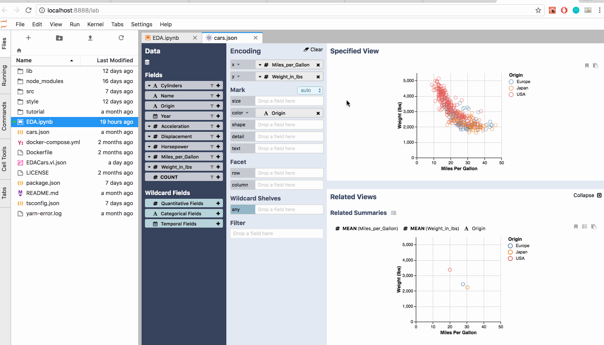

# Using Voyager in JuypterLab

## **Open Files in Voyager Extension**

To open local files in the Voyager extension, right click on a valid file \(JSON, CSV, TSV, vl.JSON\) in JupyterLab's `Files` tab, hover over `Open With`, and click `Voyager`. After opening your dataset in Voyager, you can visualize and explore your data as described in [earlier sections](https://github.com/vega/voyager-docs/tree/d3786f83366a597c44a2a2b9895ad58d7db6d039/visualizing-data/README.md) of this documentation.

## Export Visualization from Voyager Extension

You can export visualizations from Voyager to a vl.JSON \(Vega-Lite\) file or Jupyter Notebook.

### Export to vl.JSON File

To save your visualization to a vl.JSON file, right click anywhere in the `Specified View` pane, and click`Export Voyager as Vega-lite File`. You can re-open this file later [in the Voyager extension](using-voyager-in-juypterlab.md#open-files-in-voyager-extension) and JupyterLab's native Vega-Lite renderer.

### Export to Jupyter Notebook

To export your visualization to a Jupyter Notebook, right click anywhere in the `Specified View`pane, and click `Save Voyager to Jupyter Notebook`. JupyterLab will then prompt you to choose a Python Kernel. After selecting a kernel, the [Altair code](https://altair-viz.github.io/) to generate your visualization will be injected into a notebook cell. Run the cell to display your visualization.

