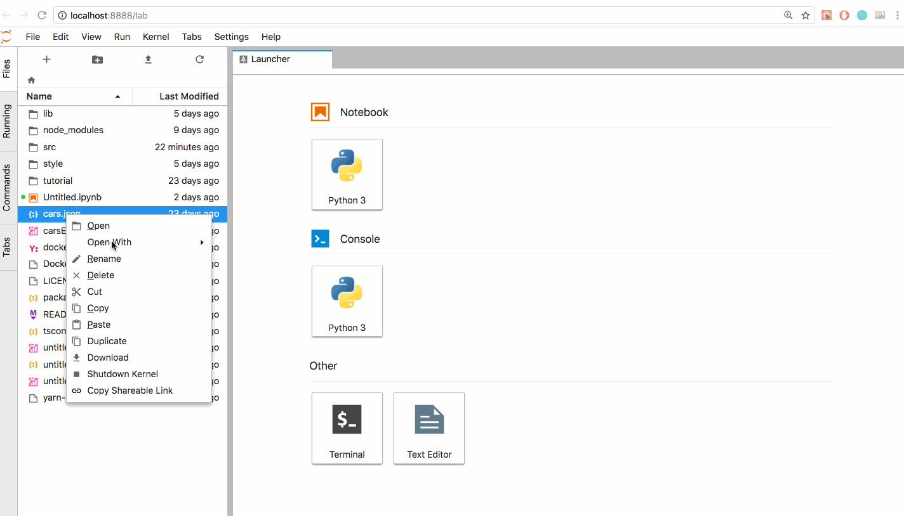

# Using Voyager in JuypterLab

### **Open Files in Voyager Extension**

To open local files in the Voyager extension, right click on a valid file  \(JSON, CSV, TSV, vl.JSON\) in JupyterLab's `Files` tab,  select `Open with`, and click `Voyager`. After opening your dataset in Voyager, you can visualize and explore your data as described in [earlier sections](visualizing-data/) of this documentation.

### Export Visualization from Voyager

You can export the visualization you specified in Voyager to a vl.JSON file or Jupyter Notebook.

#### Export Specified Visualization to vl.JSON File

To save your visualization to a vl.JSON file, right click anywhere in the `Specified View` Pane, and click`Export Voyager as Vega-lite File`. You can re-open this file later [in the Voyager extension](using-voyager-in-juypterlab.md#open-files-in-voyager-extension) or with JupyterLab's native Vega-Lite renderer.

To export the [Altair](https://altair-viz.github.io/) code to generate the specified-view as seen in Voyager, right click \(or ctrl+click if on Mac OS\) anywhere in the View Pane, and click the `Export Voyager to Notebook`option. This will prompt you to choose which Python Kernel to use. After selecting the appropriate kernel, the code will be injected into a notebook, which you can simply display by running that cell.

#### 

