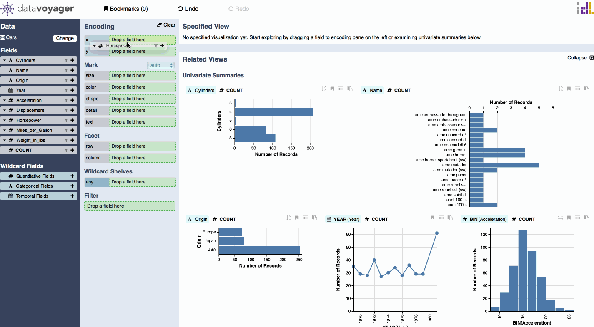
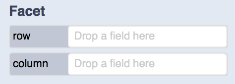

# Specify Visual Encodings

### Encoding Shelves

The encoding shelves are grouped into positional channels \(e.g. x, y\), mark channels \(e.g. size, color, shape, detail, text\), and facet channels \(e.g. row, column\). 

* To visualize data, analysts can drag-and-drop a data field onto an encoding channel shelf \(e.g., x, y, color\). By default, the system encodes raw \(unaggregated\) values. 
* Via a drop-down menu, analysts can select a transformation such as an aggregation, binning, or time unit function.

### Mark Selection

By default, the system automatically picks an appropriate mark type. Analysts can override this choice using a drop-down menu.

### Facet

The row and column channels can be used to create vertical facets and horizontal facets for trellis plots.

